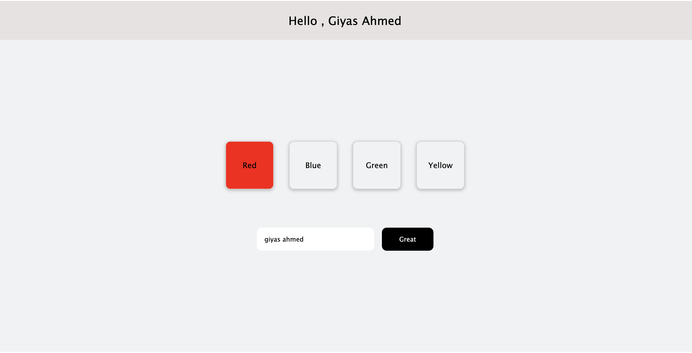

# DOM Manupulation — Project Task No. 18

## Project Overview

This project is a modern and responsive DOM manupulation project using pure HTML, CSS, and JavaScript. The application dynamically displays the input user name, and on box click color will change.

The main goal of this project is to improve understanding of:

- DOM Manipulation
- On click functionality.
- On keypress functionality.

The project focuses on creating a clean user experience while practicing core frontend development concepts without using any external frameworks or libraries.

---

# Project Features

- DOM manupulation

# Real-Time show username Functionality

Users can instantly enter their name and submit then show the name in UI.

The project uses:

- onClick method ✅
- onkeypress method ✅
- inputValue ✅
- TextContent ✅
- style change using JS ✅

# JavaScript Concepts Practiced

This project is especially useful for beginners learning JavaScript array methods and DOM manipulation.

# How to Run the Project

# Step 1: Download the Project

Download or clone the project files.

# Step 2: Open in Code Editor

- Open the project folder in any code editor such as:

- VS Code
- Sublime Text
- Atom

# Step 3: Run the Project

Open the index.html file in your browser.

You can:

Double-click the index.html file
OR use the Live Server Extension in VS Code
Learning Outcomes

- After completing this project, you will understand:

✅ How dynamic rendering works in JavaScript
✅ How to manipulate the DOM
✅ How array (using foreach) methods work in real-world projects
✅ How responsive UI layouts are built

# Future Improvements

Possible future enhancements include:

- Backend database integration
- Local storage support
- Framework version using React.js

# Author

Developed with ❤️ by Giyas Ahmed.

Happy Coding... 💻

# License

This project is created for educational and practice purposes only.